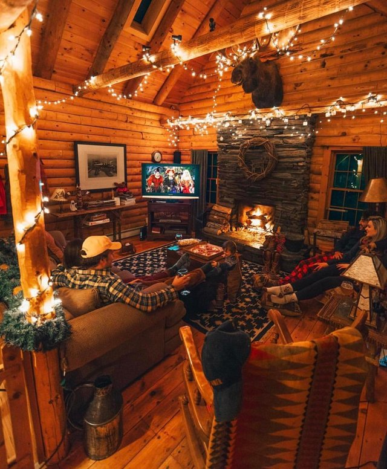
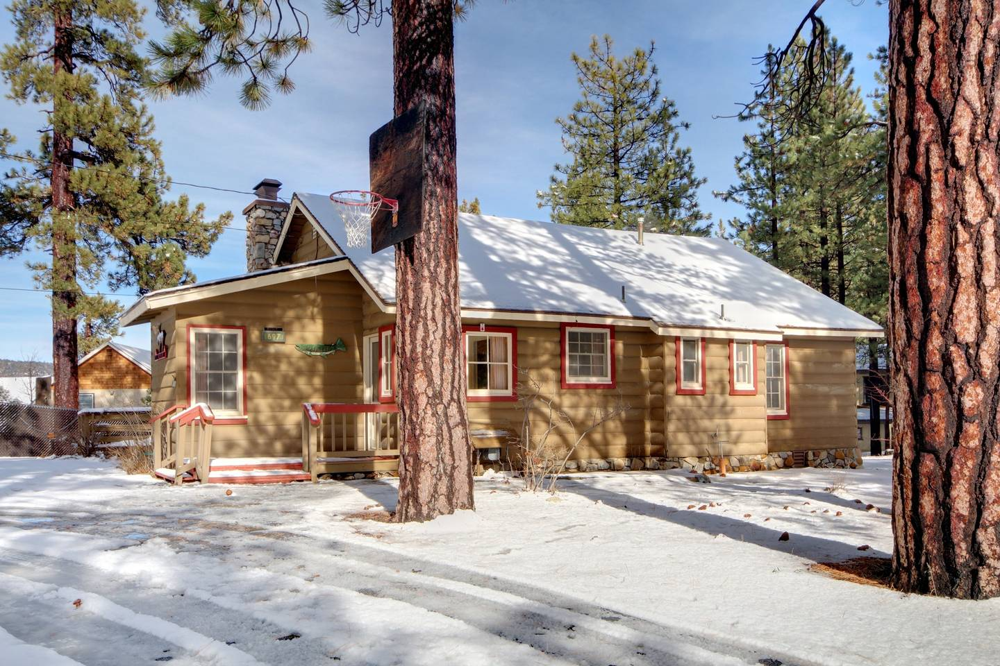

# 没有谋杀案的暴风雪山庄度假

侦探小说中非常经典的暴风雪山庄/孤岛别墅设定，如果没有谋杀案，明明就是最理想的度假方式。且听我细细道来。

首先是事件的主要舞台。

山庄/别墅本身必然富丽堂皇，或者即便是小木屋也必须舒适温馨。原木组成的墙壁天花板让人有耳目一新的感觉。宽敞的大厅，娱乐室，干净的厨房，卫生间等等应有尽有。为了有足够的时间窗口和空间来实施进行杀人手法，卧室必然每人一间，所以完全不必担心存在平日出游为了省钱和凑活所有人挤在一间臭烘烘房间睡觉的情况。

为了锁定可能的嫌疑人在人群中而展开推理，山庄/别墅一般与外界处于隔离的状态。物理方面一场大雪犹佳，室外寒冷新鲜的空气与室内温暖欢快的氛围相得益彰，没有人会想冒着各种不适和危险而着急奔向下一个景点。为了切断与警察的联系而让侦探大显身手，山庄/别墅的通信状态也会经常是被孤立的情况。因此请大家尽情享受与各位旅伴在此的休闲时光。

连环杀人案总需要几天的时间来完成，因此山庄/别墅内总会备有充足的食物。甚至常常还会配备一个管家式的人物负责准备丰盛的早中晚饭，来确保大家的精力全部由于破案/杀人。当然没有杀人案的话就全身心地放松就好了。

接下来是登场的各位人物。

他们的关系既不会是知根知底抱团旅行的一群学生，也不会是完全临时聚在一起的陌生人。太过熟识的封闭小团体是不会出现的，否则持续的抱团行动会导致与其他人缺乏互动，使得他们的在事件中的功能性大大减弱，同时会导致凶手缺乏下手的时机。另一方面，人与人之间绝不会是完全陌生以致于只有流于表面的问候和不痛不痒的尴尬对话：为了提供足够的杀人动机，他们之间的关系必然是错综复杂的，可能是曾经暗地里单方面相识，可能是明面上的久别重逢，也可能是谁也不认识的侦探先生的情况。但不论如何认识旅伴的过程既不会艰难生涩又将充满了惊喜和未知的新鲜感。

一些功能性角色也会起到特别的作用：一个开朗的老好人组织者可以保证一切活动的顺利开展，为凶手提供丰富多样的施展手法的时机和空间；一到两个拥有魅力的（通常是女性）角色能有效地提升团队的凝聚力，防止人心涣散而使凶手失去躲藏的可能和下手的目标；若干刺头的存在为冷场和停滞的状况提供冲突等剧情推进所需要素；以及即便是路人角色也能很好的起到隐藏凶手身份的作用（桌游凑人头）。

## 现实映射

如果这一切只能存在于小说中那实在是太可惜了。不过事实上这很可能变为现实。如果你对我下面列出的行程样例感兴趣，请发送邮件给我。你当然可以在邮件中推销自己，或附上简历，或暗中联系进行某些交易。我将~~公正地~~从中筛选出最符合这场度假的人选组合。

Image from reddit/CozyPlaces

Image from airbnb

* 地点：[Big Bear Lake, CA 大熊湖](https://www.google.com/maps/place/Big+Bear+Lake,+CA)周边某cabin或house
* 2018圣诞假期期间（价格是淡季数倍）三夜
* 携带道具
    - 聚餐/BBQ食材和饮料 （景区物价较贵）
    - 滑雪远足衣物装备（摄氏零下温度）
    - 各类桌游
    - 游戏PC，Console，手柄，VR等
* 活动
    - 白天：滑雪，绕湖自驾，登山trial
    - 晚上：BBQ，桌游，游戏，VR，聊天

Image from youtube